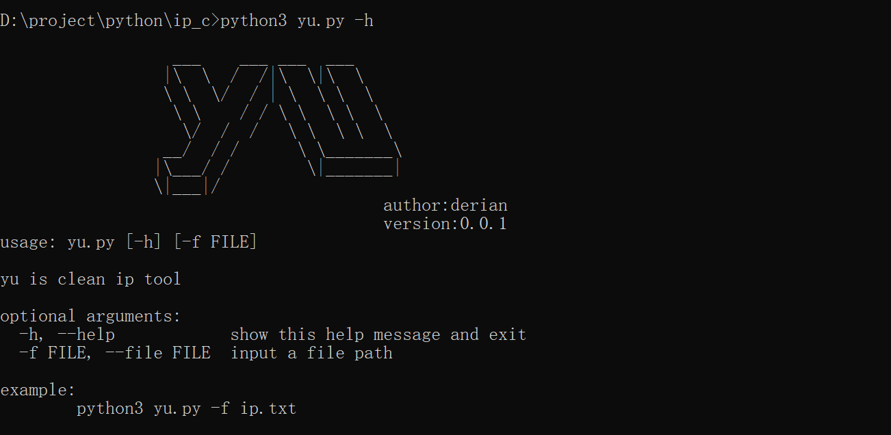
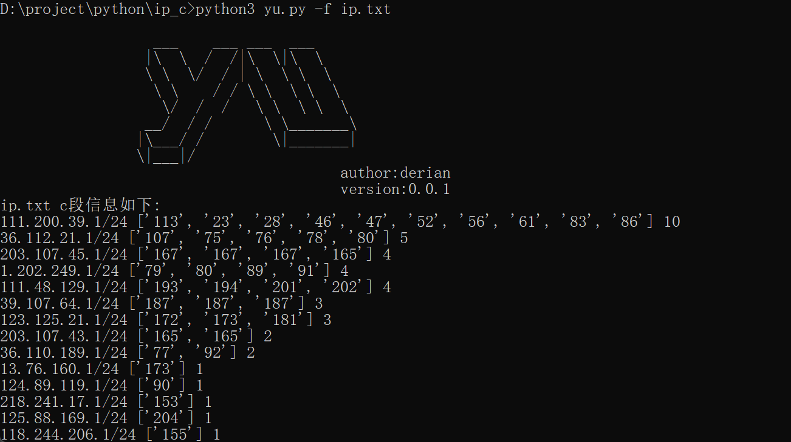

## 介绍

yu是一款快速整理ip c段信息的脚本 , 方便渗透测试人员能够快速整理目标ip范围

## 使用

环境

```python
windows / linux 
python version >= 3.7
```

使用方法

```python
# 查看帮助信息
python3 yu.py -h
```



```
# 指定ip文件 
python3 yu.py -f ip.txt
```



## 免责声明🧐

本工具仅面向合法授权的企业安全建设行为，如您需要测试本工具的可用性，请自行搭建靶机环境。

在使用本工具进行检测时，您应确保该行为符合当地的法律法规，并且已经取得了足够的授权。请勿对非授权目标进行扫描。

如您在使用本工具的过程中存在任何非法行为，您需自行承担相应后果，我们将不承担任何法律及连带责任。